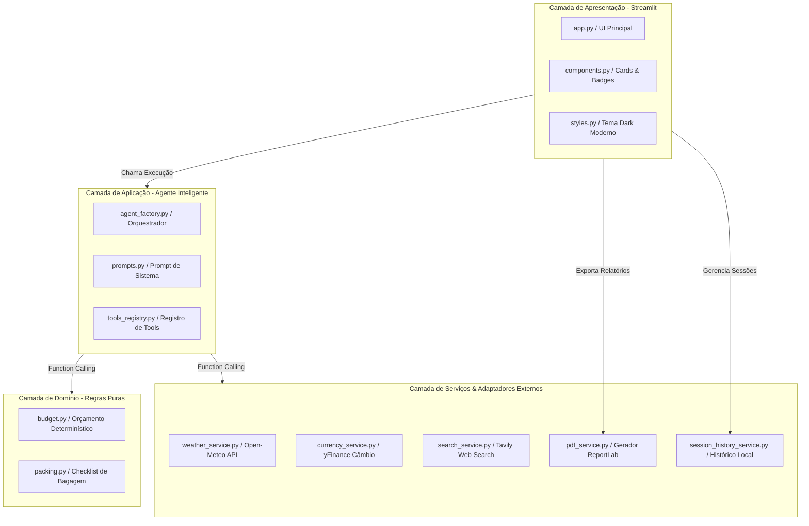

<h1 align="center">
  <a href="https://git.io/typing-svg">
    
  </a>
</h1>

<div align="center">

[](https://www.python.org/)
[](https://aistudio.google.com/)
[](https://console.groq.com/)
[](https://github.com/agno-agi/agno)
[](https://streamlit.io/)
[](https://www.reportlab.com/)
[](#-arquitetura-técnica-clean-architecture)

</div>

---

# ✈️ TripMind AI — Assistente Roteirista de Viagens Inteligente

Seja muito bem-vindo ao repositório do **TripMind AI**, um ecossistema de **Agente Inteligente Autônomo** projetado para o planejamento e roteirização personalizada de viagens nacionais e internacionais. 

O sistema integra previsão meteorológica em tempo real, cálculo orçamentário determinístico (sem alucinações matemáticas), pesquisa web com síntese de atrações locais, geração de checklist de bagagem adaptativo, exportação de relatórios em **PDF diagramado com Mapa Mental vetorial** e arquitetura de **resiliência com fallback automático entre múltiplos modelos de linguagem (Google Gemini e Groq Cloud)**.

---

## 👨‍💻 Sobre o Desenvolvedor

<div align="justify">

Olá, Leitor! Meu nome é **Caio Magalhães**, tenho 21 anos e sou graduando em **Sistemas de Informação** no **CEFET-MG** (*Centro Federal de Educação Tecnológica de Minas Gerais — Unidade Varginha*). 

Este projeto foi concebido e construído no âmbito da disciplina de **Inteligência Artificial (IA I)**, onde cada aluno recebeu a missão de criar um agente conversacional autônomo com um caso de uso prático de mercado. O **TripMind AI** expande diretamente a base teórica e prática lecionada em aula (scripts de *Function Calling*, *Tool Registry* e orquestração de LLMs), elevando esses conceitos ao estado da arte por meio de **Clean Architecture**, memória multi-turn viva, desacoplamento estrito de regras de negócio e interfaces modernas de alta fidelidade visual.

</div>

---

## 💡 Motivação e Pilares do Projeto

Planejar uma viagem envolve múltiplas variáveis que frequentemente geram frustrações quando feitas manualmente: clima imprevisível estragando passeios ao ar livre, orçamentos imprecisos calculados incorretamente por modelos de IA e esquecimento de itens essenciais de bagagem.

O **TripMind AI** resolve esse desafio por meio de **5 Pilares de Engenharia de IA**:

1. **Roteiro Climático Adaptativo**: Consulta em tempo real a previsão meteorológica diária via **Open-Meteo API** (sem exigência de chave). Dias chuvosos priorizam automaticamente atrações cobertas (museus, centros culturais, gastronomia e cafés), enquanto dias ensolarados priorizam praias, parques e mirantes.
2. **Orçamento Determinístico em BRL**: Elimina 100% das alucinações matemáticas comuns em LLMs. Os custos por categoria (*Alimentação, Passeios, Transporte Local e Reserva de Emergência*) são processados por funções matemáticas puras em Python baseadas nos perfis *Econômico*, *Moderado* ou *Luxo*.
3. **Memória Contextual Multi-Turn**: O agente mantém a retenção contínua da viagem ativa em todos os turnos do diálogo. Se o usuário informar destino, datas e orçamento na primeira mensagem, qualquer pergunta subsequente (*"Recomende 3 restaurantes"* ou *"O que fazer no segundo dia?"*) manterá a coerência com a cidade e as restrições financeiras.
4. **Exportação Executiva em PDF com Mapa Mental**: Motor de diagramação em **ReportLab** que sintetiza todo o planejamento em um documento PDF profissional com **Mapa Mental vetorial estilizado**, tabelas de custos e checklist para impressão.
5. **Arquitetura Dual-Brain com Fallback Resiliente**: Modelo primário operando com o **Google Gemini 3.6 Flash**. Caso a cota gratuita do provedor seja temporariamente atingida (HTTP 429), a aplicação executa um *hot-swap* transparente para o **Groq Cloud (GPT-OSS 120B)** sem interrupção para o usuário final.

---

## 🛠 Tech Stack

<table align="center">
   <tr>
      <td align="center">
         
         <br /><sub>Python 3.10+</sub>
      </td>
      <td align="center">
         
         <br /><sub>Gemini 3.6 Flash</sub>
      </td>
      <td align="center">
         
         <br /><sub>Groq Cloud</sub>
      </td>
   </tr>
   <tr>
      <td align="center">
         
         <br /><sub>Streamlit</sub>
      </td>
      <td align="center">
         
         <br /><sub>Agno Framework</sub>
      </td>
      <td align="center">
         
         <br /><sub>ReportLab PDF</sub>
      </td>
   </tr>
</table>

---

## 🏛 Arquitetura Técnica (Clean Architecture)

Para atender aos rigorosos critérios acadêmicos e de Engenharia de Software, o projeto adota a separação estrita de responsabilidades (*Separation of Concerns*) em 4 camadas modulares:



### 📁 Estrutura de Pastas do Repositório

```text
tripmind/
├── .env                       # Variáveis de ambiente e chaves de API
├── requirements.txt           # Dependências universais pinadas
├── iniciar.sh                 # Script automatizado de 1 comando para Linux Mint
├── iniciar.bat                # Script automatizado de 2 cliques para Windows
├── app.py                     # Ponto de entrada raiz do Streamlit
├── agent.py                   # Ponto de entrada CLI interativo para terminal
├── smoke_test.py              # Bateria de testes automatizados ponta a ponta
├── README.md                  # Documentação técnica e guia do projeto
│
├── scripts/                   # 📚 Scripts originais de estudo da disciplina
│   ├── script01.py            # Invocação direta de LLM (Groq)
│   ├── script02.py            # Agente com TavilyTools (Busca Web)
│   ├── script03.py            # Agente com YFinanceTools e tabelas
│   └── script04.py            # Agente com Tools customizadas em Python
│
└── src/                       # 📦 Código Modularizado (Clean Architecture)
    ├── config/                # Leitura e validação centralizada de configurações
    │   ├── __init__.py
    │   └── settings.py
    ├── domain/                # Regras de Negócio Puras (100% testáveis sem IA)
    │   ├── __init__.py
    │   ├── budget.py          # Cálculo matemático de custos diários
    │   └── packing.py         # Regras determinísticas de seleção de bagagem
    ├── services/              # Adaptadores de infraestrutura e APIs externas
    │   ├── __init__.py
    │   ├── weather_service.py # Integração com Open-Meteo (Geocoding + Forecast)
    │   ├── currency_service.py# Cotação cambial atualizada com yFinance
    │   ├── search_service.py  # Busca web em tempo real (Tavily com fallback)
    │   ├── pdf_service.py     # Gerador de PDF diagramado com mapa mental
    │   └── session_history_service.py # Histórico de conversas em memória local
    ├── agent/                 # Orquestração do Agente e Ferramentas (Agno)
    │   ├── __init__.py
    │   ├── prompts.py         # Prompt executivo em Português
    │   ├── tools_registry.py  # Serialização JSON e docstrings de ferramentas
    │   └── agent_factory.py   # Fábrica de Agentes com suporte Gemini e Groq
    └── ui/                    # Apresentação visual moderna (Streamlit)
        ├── __init__.py
        ├── app.py             # Aplicação reativa (Chat, Cards e Assistente)
        ├── components.py      # Componentes reutilizáveis e menu popover
        └── styles.py          # Folha de estilos CSS personalizada
```

---

## 🎓 Conexão Acadêmica: Da Teoria ao TripMind AI

O **TripMind AI** foi estruturado como uma extensão direta dos 4 tópicos práticos ministrados pelo professor na disciplina:

| Script de Aula (`scripts/`) | Conceito Ensinado | Implementação no TripMind AI |
| :--- | :--- | :--- |
| **`script01.py`** | Chamada direta a LLM via Groq | Suporte a **Groq (`openai/gpt-oss-120b`)** e **Google Gemini (`gemini-3.6-flash`)** com alternância dinâmica. |
| **`script02.py`** | Agentes com Web Search (`TavilyTools`) | Módulo **`search_service.py`** com busca de eventos, gastronomia e atrações atualizadas. |
| **`script03.py`** | Agentes com dados financeiros (`YFinanceTools`) | Módulo **`currency_service.py`** com conversão em tempo real de moedas estrangeiras para BRL. |
| **`script04.py`** | Tools customizadas em Python puro | Módulos **`budget.py`**, **`packing.py`** e **`weather_service.py`** convertidos em *Tool Calling* pelo Agno. |

---

## 💻 Guia Completo de Execução

### 🐧 Tutorial Passo a Passo para Linux Mint (Laboratórios da Faculdade)

As máquinas de laboratório do CEFET-MG utilizam a distribuição **Linux Mint**. Para garantir que a aplicação suba sem qualquer fricção, utilize um dos dois métodos abaixo:

#### Método A: Execução em 1 Comando (Recomendado)
Abra o terminal dentro da pasta do projeto e execute:

```bash
bash iniciar.sh
```

> **O que o script faz automaticamente:**
> 1. Detecta o interpretador Python 3 do Linux Mint.
> 2. Cria o ambiente virtual isolado (`.venv`) caso ainda não exista.
> 3. Instala/atualiza todas as dependências pinadas no `requirements.txt`.
> 4. Inicia o servidor Streamlit e abre o navegador padrão em `http://localhost:8501`.

#### Método B: Passo a Passo Manual no Terminal
Se preferir executar manualmente cada instrução:

```bash
# 1. Atualizar e verificar pacotes do sistema
sudo apt update && sudo apt install -y python3 python3-venv python3-pip

# 2. Criar o ambiente virtual na pasta do projeto
python3 -m venv .venv

# 3. Ativar o ambiente virtual
source .venv/bin/activate

# 4. Instalar as dependências necessárias
pip install --upgrade pip
pip install -r requirements.txt

# 5. Executar a aplicação Streamlit
streamlit run app.py
```

---

### 🪟 Tutorial Passo a Passo para Windows

#### Método A: Execução em 2 Cliques
Dê **dois cliques** no arquivo executável **[`iniciar.bat`](file:///c:/Users/Gamer/OneDrive/Área%20de%20Trabalho/Faculdade%20Prog/tripmind/iniciar.bat)** localizado na raiz do projeto. Ele detectará o ambiente e abrirá a interface automaticamente no navegador.

#### Método B: Execução via PowerShell
Abra o PowerShell na pasta do projeto e execute:

```powershell
# 1. Ativar o ambiente virtual
.\.venv\Scripts\Activate.ps1

# 2. Instalar dependências (caso seja a primeira execução)
pip install -r requirements.txt

# 3. Iniciar o servidor Streamlit
streamlit run app.py
```

---

## ⚙️ Variáveis de Ambiente (`.env`)

Crie um arquivo chamado **`.env`** na raiz do projeto (ou copie de `.env.example`):

```env
# Chave Principal (Google AI Studio - Gratuito)
GEMINI_API_KEY=sua_chave_gemini_aqui

# Chave de Fallback e Inferência Rápida (Console Groq - Gratuito)
GROQ_API_KEY=sua_chave_groq_aqui

# Chave de Pesquisa Web em Tempo Real (Tavily - Opcional)
TAVILY_API_KEY=sua_chave_tavily_aqui

# Provedor Inicial Padrão (gemini ou groq)
MODEL_PROVIDER=gemini
```

> **Dica:** O TripMind funciona perfeitamente mesmo se a chave do Tavily não for configurada (ele utilizará a API pública do Open-Meteo para clima e a base de conhecimento do modelo para atrações).

---

## 🧪 Bateria de Testes Automatizados

O repositório conta com uma suíte de testes de fumaça (*Smoke Tests*) que valida todas as camadas da aplicação sem consumir tokens desnecessários:

```bash
python smoke_test.py
```

```text
============================================================
Testes Automatizados do TripMind AI (Clean Architecture)
============================================================

[1/4] Testando Camada de Domínio (Regras Puras)...
  [OK] Orçamento calculado com sucesso: R$ 3,520.00
  [OK] Checklist de mala gerado: 7 itens de vestuário.

[2/4] Testando Camada de Serviços (APIs Externas)...
  [OK] Clima consultado para Salvador, Brasil: 3 dias.
  [OK] Câmbio USD -> BRL: US$ 100 = R$ 513.64 (Cotação: 5.1364)

[3/4] Testando Inicialização do Agente Agno...
  [INFO] Provedor ativo: gemini (Gemini Key presente: True)
  [OK] Agente criado: 'TripMind AI' com 5 ferramentas registradas.

[4/4] Testando Execução do Agente (Gemini/Groq)...
  [OK] Resposta do Agente: TRIPMIND_OK

============================================================
Bateria de testes concluída com sucesso!
============================================================
```

---

## 🤝 Agradecimento

Muito obrigado por conhecer o **TripMind AI**! Este projeto consolida conhecimentos práticos fundamentais sobre **Engenharia de Agentes Autônomos**, **Clean Architecture**, **Sistemas Baseados em Conhecimento** e interfaces modernas de IA aplicadas a desafios reais de turismo e planejamento.

---

## 📞 Contato & Redes Sociais

Caso queira acompanhar outros projetos acadêmicos e profissionais de desenvolvimento de software:

<div align="center">

<a href="https://wa.me/5535998906096" target="_blank">
  
</a>
<a href="https://www.instagram.com/caio.json/" target="_blank">
  
</a>

</div>

---

<div align="center">
  <sub>© 2026 Caio Magalhães · Sistemas de Informação · CEFET-MG. Projetado e construído com 💻, 🧠 e ☕ em Varginha, MG.</sub>
</div>

